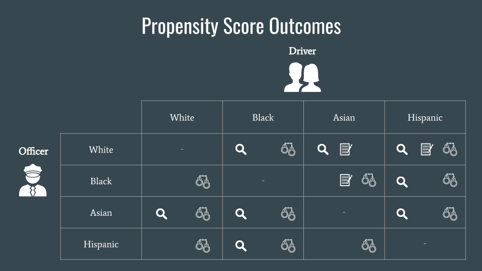

# Does Police Officer Race Influence Stop Outcomes?

## Project Intro

In recent years, in San Diego and in many other cities, tensions between the cities' police forces and its residents have risen. Claims of racial discrimination by police officers have led to numerous investigations and litigation. Studies of U.S. policing data, such as a recent investigation by researchers at San Diego State University, have uncovered instances of police officers treating people in similar situations differently.  It appears that race may play a part in those differing police actions. 

To expand on the studies conducted in this area, our research group is looking to investigate how a police officer’s race affects his or her decision-making process during traffic stops. Police are faced with many choices when monitoring motorists, such as whether to pull a driver over, whether to search the driver and whether to cite and/or arrest the driver.  If race is not an important factor in influencing a police officer's actions, then these outcomes should be independent of the races of both the driver and the officer. To test such an assumption, we will examine traffic stops made under similar circumstances and analyze the outcomes of those stops to determine if the races of the police officer and the driver are a factor in the outcomes. If they are, this might indicate that race does play an important role in the behavior of police officers when conducting traffic stops.

To ensure that our conclusions are more general, and not simply particular to a single police force, we will include data from multiple cities in our study. Florida, South Carolina, and Pittsburgh, Pennsylvania are three places that differ in geographic location as well as racial makeup.  Including these cities in our analysis will allow us to make a more general conclusion as to whether race is a factor in policing and whether such discrimination is localized or more widespread.

Our research is important because it can indicate how the race of police officers assigned to certain service areas affects the racial disparities seen in traffic stops data. The results of this analysis may provide some guidance as to whether discrimination in traffic stops could be lessened by taking the racial composition of the service area into account when assigning police officers of various races to those given areas.

## The Problem

In our project , we are examining the findings from Antonovics and Knight in *A New Look at Racial Profiling*, in which the two authors investigated whether preference-based discrimination, as opposed to statistical discrimination, was responsible for the racial disparities seen in traffic stop data. In making this determination, the researchers investigated whether the race of the officer making the stop had an effect on the officer’s decision to search a driver was had pulled over. The belief is that the experience of police officers over time will cause them to use the observable characteristic, race, as a surrogate for the unobservable characteristics that may cause differences in driving habits. In this report, the authors found that officers are more likely to pull over drivers whose race differs from their own and thus concluded that preference-based discrimination was a key factor in officers’ decisions to conduct searches after traffic stops. To expand on such analysis, our project hopes to investigate how the race of the driver and race of the police officer influence an officer's decision to initiate traffic stops and to search, cite or arrest a driver. Stop pairs by location are as follows:

## Data Description

Add information about data ingestion here and include exploratory data analysis...

*... put interactive plot here to allow audience to do exploratory data analysis for themselves...*

*... potential to add real-world example of racial bias in traffic stops here...*

## Analysis

To determine whether the races of drivers and officers involved in a stop are a factor in the officer’s decision to pull a driver over, we will use the Veil of Darkness technique. This technique utilizes natural lighting, or the lack of it, so that researchers can compare the racial distribution of traffic stops made in daylight with that of stops made after dark. If there is an increase in stop rates for a specific officer/race pairing during the daylight, it can be shown that racial bias, as opposed to only racial disparity, exists in the initiation of traffic stops. 

To ensure that we isolate the effect that preference-based discrimination has on an officer’s decision to search, cite or arrest a driver, we must remove, or limit, the effect that other variables (e.g., location, time, stop cause) have on an officer's stop decisions. In our analysis, we will do this by employing propensity score analysis. Using this statistical matching technique will involve:
1. Developing propensity score functions, which estimate the likelihood of a stop resulting in the driver being searched, cited and arrested. 
2. Computing a propensity score for each stop. 
3. Dividing the traffic stops into multiple groups based on the races of the driver and the officer involved in the stop. 
4. Matching stops from the above groups to form strata. 
5. Perform statistical testing (e.g., 1 for searched/cited/arrested and 0 for not searched/not cited/ not arrested) to draw conclusions about the effect of the race on post-stop outcomes.  

This process is visually depicted below:  

## Conclusion / Next Steps

Shown below is a chart specifying the outcomes which we found significant for specific driver race pairings:

  

This chart can be read in two ways:
1. Starting with officers and then considering drivers.   
   - For example, if we consider white officers (i.e, the first row), looking at the column corresponding to Asian drivers (i.e., the third column) tells us that white officers search and cite Asian drivers more than white officers search and cite white drivers. 
2. Starting with drivers and then considering officers.   
   - For example, if we consider white drivers (i.e, the first columns), looking at the row corresponding to Asian officers (i.e., the third row) tells us that white drivers are searched and cited by Asian officers more than white drivers are searched and cited by white officers.

As can be seen in the chart above, our research found that preference-based discrimination is present in traffic stops and that police officers are more likely to search and arrest drivers outside their racial group. This research suggests that preference-based discrimination by police officers is not specific to a racial group; it is more widespread.

From this research, we hope to bring awareness to the role that race, both of the police officers and of the drivers, plays in the outcome of traffic stops. Our hope is that awareness on behalf of the police departments would lead to an enhancement of general officer training around the issues of racial discrimination, thus making traffic stops more impartial. 

Additional research using higher volumes of traffic stops and with more traffic stops variables could make our propensity score analysis more reliable. Furthermore, research analyzing the cost of traffic stop citations and length of time of traffic stop arrests could further inform us the extent to which officers are more lenient to drivers in their racial group. 
